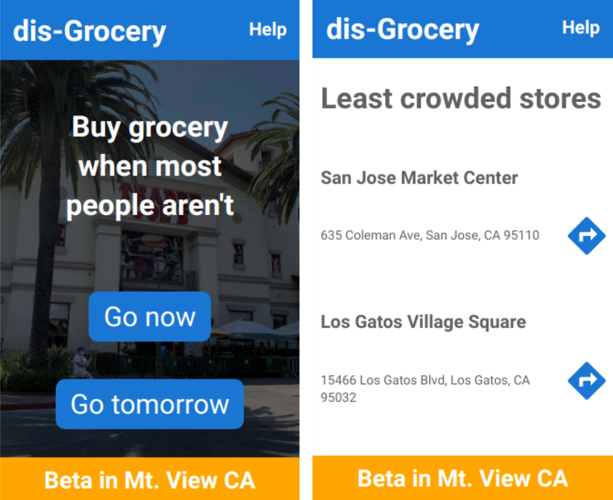

# dis-Grocery App

## What is dis-Grocery?
The dis-Grocery App promotes socially-distanced grocery shopping by identifying the least crowded stores nearby.  While the app is in beta, only Trader Joe's around Mountain View CA are considered.

## Demo
For live demo, visit https://www.disgrocery.app.

## Why do we need another App?
Social distancing is one of the best tools we have to fight Covid-19 before a vaccine or an effective is available.  While intuition such as going to the stores during a weekday helps, we can do better with real-time location data.  A data-driven recommendation enables us to avoid an unexpected crowded situation just because lots of people
 assume a store is not going to be crowded at noon on a Wednesday.  Altough a social distancing feature can be implemented in a mapping app, social distancing may not be fully aligned with the commercial incentives behind an existing app.  The feature may also be implemented in a location-based contact-tracing app.  The dis-Grocery App is a proof-of-concept showing us how technology can promote social distancing.

## What is coming next?
Grocery shopping is just one of many activities where social distancing is not always practical.  If you're part of an organization with access to location data, please take this idea and run with it.  We need recommenders for least crowded parks, hiking trails, food banks, etc.

## License
dis-Grocery is under the MIT license.
